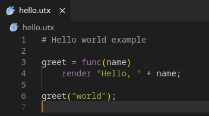

# Uartix VSCode Extension

Uartix Syntax Highlighting is a Visual Studio Code extension that provides syntax highlighting for the Uartix programming language. This extension helps developers write and manage Uartix scripts more effectively by offering enhanced code readability through proper syntax highlighting.

- **Syntax Highlighting**: Automatically highlights Uartix syntax, including keywords, operators, strings, numbers, comments, and more.
- **File Association**: Automatically associates .utx files with the Uartix language mode in VS Code.
- **Icon Support**: Displays a custom icon for Uartix files in the VS Code explorer.

    

## License

See license [here](LICENSE).